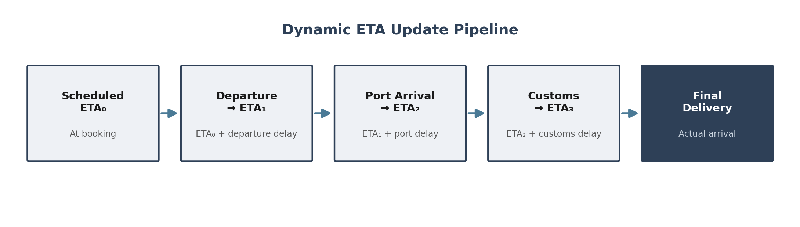
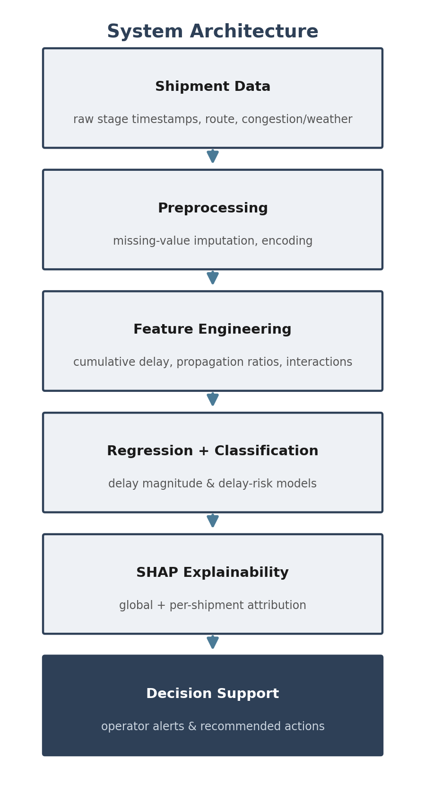

__Technical Report: Shipment ETA Prediction & Delay Propagation System__

*Safiri AI — AI Internship Take\-Home Assignment*

# 1\. Introduction

## 1\.1 Problem Statement

In global logistics, delays at one stage of a shipment — late vessel departure, port congestion, or customs bottleneck — rarely remain isolated\. They propagate downstream, compounding at each successive stage and ultimately amplifying the total delivery delay far beyond the initial disruption\.

This project addresses three interconnected challenges:

- Predict the final delivery delay of a shipment given upstream stage information
- Classify whether a shipment will experience a significant delay \(> 1 day\)
- Explain which factors drive the predicted delay — both globally and for individual shipments

## 1\.2 Approach Summary

We adopt a domain\-driven machine learning approach that explicitly models delay propagation dynamics\. Rather than treating the final delay as an independent target, our feature engineering captures how delays cascade through the 4\-stage shipment pipeline \(Departure → Port Arrival → Customs Clearance → Final Delivery\)\.

# 2\. Data Description

## 2\.1 Dataset Overview

We use a synthetic dataset of 250 shipment journeys spanning 10 major trade lanes:

__Attribute__

__Value__

Total shipments

250

Trade lanes

10 \(8 sea, 2 air\)

Stages per shipment

4 \(Departure, Port, Customs, Final\)

Missing data

9\.2% of customs clearance records

Delay rate \(>1 day\)

66\.4% of shipments

## 2\.2 Data Generation Assumptions

The synthetic data was generated with explicit delay propagation:

- Departure delay follows an exponential distribution \(random operational events\)
- Port delay depends on: departure delay × 0\.30 \+ congestion × route\_factor
- Customs delay depends on: port delay × 0\.40 \+ weather impact
- Final delay depends on: customs delay × 1\.00 \+ 0\.2 × port \+ 0\.1 × departure \+ noise

This cascading structure simulates the real\-world phenomenon where upstream disruptions amplify through the supply chain\.

## 2\.3 Missing Data Strategy

Missing customs clearance data \(~9%\) was imputed using route\-corridor median delay — a strategy motivated by the observation that customs processing times vary significantly between trade lanes \(e\.g\., US CBP vs\. Singapore Customs\)\. A customs\_data\_missing indicator flag was created to preserve the information signal from missingness itself\.

## 2\.4 ETA Formulation

In real logistics systems, ETA is not a fixed timestamp determined at shipment departure\. Instead, ETA is continuously revised as new operational information becomes available at each stage of the shipment lifecycle\. We adopt this view explicitly rather than treating ETA as a single static prediction target\.

Concretely, we define ETA as a running quantity that is updated after each stage:

- ETA₀ = Scheduled Delivery \(set at booking, before departure\)
- ETA₁ = ETA₀ \+ Departure Delay \(revised once the shipment actually departs\)
- ETA₂ = ETA₁ \+ Additional Port Delay \(revised once port arrival is observed\)
- ETA₃ = ETA₂ \+ Customs Delay \(revised once customs clearance is observed\)
- Final ETA = ETA₃ \+ any residual delivery\-leg delay, which converges to the actual delivery timestamp

This formulation reframes our regression target: delay\_final\_days is the cumulative correction applied to ETA₀ across all stages, and the delay\-propagation features described in Section 3 are precisely what allow the model to estimate each successive revision \(ETA₁ → ETA₂ → ETA₃\) rather than jumping directly from booking to a single final number\. This is also what makes the system deployable stage\-by\-stage: at each checkpoint, the model can re\-estimate the remaining delay using only the information observed so far, producing an updated ETA in real time instead of one static forecast made at booking\.

*Figure 1\. ETA is revised at each stage rather than fixed at booking; each update incorporates the delay observed at the preceding stage\.*

# 3\. Feature Engineering

## 3\.1 Design Philosophy

Every feature was designed to reflect how logistics professionals reason about delays, not arbitrary statistical transformations\. We engineered 35 features, grouped into 4 core categories described below\.

## 3\.2 Feature Categories

### Delay Propagation Features \(most important category\)

- Cumulative delay at each stage \(determines if downstream schedules are recoverable\)
- Delay acceleration \(is the disruption growing or being absorbed?\)
- Propagation ratios \(how much does each stage amplify the upstream delay?\)

### Route Risk Features

- Sea routes receive a higher risk factor \(1\.5x\) than air \(0\.5x\), reflecting their greater exposure to congestion, weather, and canal bottlenecks
- Congestion × route\_factor interaction captures the amplified impact on sea lanes

### Temporal Features

- Peak season indicator \(Oct\-Dec for pre\-holiday surge; Jan\-Feb for Chinese New Year disruption\)
- Day of week \(weekend departures may indicate scheduling irregularities\)

### External Interaction Features

- Congestion × weather interaction models the non\-linear compounding effect when multiple disruptions occur simultaneously \(e\.g\., typhoon season \+ port congestion\)

# 4\. Modeling Strategy

## 4\.0 Evaluation Setup

To ensure robust evaluation on our 250\-record dataset, all models were evaluated using 5\-fold cross\-validation\. For the classification task, we used Stratified 5\-fold CV to maintain the target class distribution \(66\.4% delayed vs\. 33\.6% on\-time\)\. Additionally, class\_weight="balanced" was applied to our baseline Logistic Regression model to prevent the class imbalance from skewing predictions toward the majority class, ensuring reliable precision and recall metrics\. Unless otherwise noted, all metrics reported below are the mean across the 5 folds\.

## 4\.1 Regression: Predicting Delay Magnitude

Target: delay\_final\_days \(continuous, in days\)

We trained three models to compare linear vs\. non\-linear approaches:

__Model__

__MAE \(days\)__

__RMSE \(days\)__

__R²__

Ridge Regression

0\.2658

0\.3288

0\.7483

XGBoost

0\.2789

0\.3521

0\.7113

LightGBM

0\.2916

0\.3682

0\.6843

*Values represent the mean of each metric across the 5 cross\-validation folds\.*

To put this in operational context: average transit time across the 10 trade lanes in our dataset is approximately 15 days\. A MAE of 0\.2658 days for Ridge Regression therefore corresponds to roughly 6\.4 hours of average prediction error on the final ETA — a level of precision that is directly actionable for planning dock and warehouse scheduling\.

Observation: Ridge Regression performs comparably to tree\-based models\. This is primarily because with a limited sample size of only 250 records, highly parameterized tree\-based models \(XGBoost/LightGBM\) are more prone to overfitting and struggle to fully leverage non\-linear interactions without more data\. Additionally, the underlying data generation process has a strong linear component \(weighted sums of upstream delays\), which Ridge captures effectively\.

## 4\.2 Classification: Delay Risk Prediction

Target: is\_delayed \(binary, delay > 1 day\)

__Model__

__Accuracy__

__F1 Score__

__AUC\-ROC__

Logistic Regression

0\.812

0\.8498

0\.8675

LightGBM Classifier

0\.788

0\.8418

0\.8613

*Values represent the mean of each metric across the 5 stratified cross\-validation folds\.*

Both models achieve strong performance with AUC > 0\.86, indicating good discrimination ability between on\-time and delayed shipments\.

## 4\.3 End\-to\-End System Architecture

The components described above \(preprocessing, feature engineering, regression, classification, and explainability\) form a single pipeline intended to support operational decision\-making rather than standalone predictions:

*Figure 2\. Data flows from raw shipment records through feature engineering into the regression/classification models, whose outputs are explained via SHAP and surfaced as operator\-facing alerts\.*

# 5\. Explainability Analysis

## 5\.1 Global Feature Importance \(SHAP\)

The SHAP analysis reveals that delay propagation features dominate the prediction:

- delay\_customs\_days — The strongest single predictor globally \(highest mean |SHAP| value across the dataset\)
- cumulative\_delay\_customs — Total accumulated delay is the next strongest signal
- delay\_port\_days — Port\-level delays carry through to final delivery
- congestion\_index — The primary external driver of delays
- propagation\_port\_to\_customs — The rate of delay amplification between stages

## 5\.2 Individual Shipment Explanation \(Example\)

For the most\-delayed shipment \(\#65, final delay = 3\.89 days\):

__Factor__

__SHAP Impact__

__Interpretation__

Customs delay = 3\.12 days

\+0\.89 days

Severe customs bottleneck

Cumulative delay = 5\.81 days

\+0\.56 days

Pipeline completely behind schedule

Port\-to\-customs propagation = 2\.40

\+0\.17 days

Delay amplifying \(not recovering\)

This explanation is designed to be operator\-facing, not just model\-facing: because customs delay is the dominant contributor and the propagation ratio shows the delay is amplifying rather than recovering, the recommended operator action for shipment \#65 would be to expedite customs documentation immediately and notify the downstream carrier of a revised ETA, rather than waiting for the delay to resolve on its own\. Translating each SHAP attribution into a concrete next step is what turns an explanation into an actionable insight\.

## 5\.3 Delay Propagation Analysis

*Note on definition: The "propagation ratio" here is defined as the average observed delay amplification \(median\(delay\_stage\_n\) / median\(delay\_stage\_n\-1\)\)\. This is a descriptive ratio of relative delay magnitude between consecutive stages, not the same quantity as the causal coefficients used during data generation \(e\.g\., 0\.30 for departure→port\)\. Because each stage also receives its own independent noise and external\-factor contributions \(e\.g\., congestion, weather\), the observed ratio reflects the combined effect of upstream carry\-over plus these additional stage\-specific sources — it should not be expected to numerically match the generation coefficients\.*

Stage\-to\-stage propagation ratios by transport mode:

__Transition__

__Sea Routes__

__Air Routes__

Departure → Port

3\.24x

2\.71x

Port → Customs

0\.76x

1\.03x

Customs → Final

1\.25x

1\.23x

Key insight: Sea routes show higher initial delay amplification \(3\.24x at Departure → Port\), heavily driven by external congestion effects compounding the initial departure delay\. However, sea routes show partial recovery at the Port → Customs transition \(0\.76x\), suggesting that port buffer times partially absorb delays\. Both modes show final\-stage amplification \(~1\.25x\), indicating that last\-mile delivery consistently adds to accumulated delays\.

# 6\. Discussion

## 6\.1 Real\-World Relevance

Our system reflects several real\-world logistics behaviors:

- Cascading delays: The model successfully captures how upstream disruptions propagate and amplify — the central challenge in supply chain ETA prediction
- Congestion as primary risk: Because the model explicitly identifies congestion as the dominant contributor to ETA degradation, logistics planners can prioritize congestion mitigation strategies such as alternative port selection or proactive schedule adjustments before downstream delays accumulate — consistent with industry experience \(e\.g\., the 2021 LA/Long Beach port crisis\)
- Route\-dependent vulnerability: Sea routes are more delay\-prone, which aligns with their longer transit times and exposure to weather, canal bottlenecks \(Suez, Panama\), and port capacity constraints — suggesting route\-specific buffer times rather than a one\-size\-fits\-all schedule
- Data quality as signal: Missing customs data carries predictive value, reflecting the real\-world correlation between poor tracking visibility and operational issues, and can itself be used as an early trigger for manual follow\-up

## 6\.2 Limitations

- Synthetic data: While the propagation structure is realistic, real\-world delays exhibit higher variance and more complex dependencies \(multi\-leg routings, transshipment, carrier\-specific behavior\)
- Static features: The current model does not incorporate real\-time signals \(AIS vessel tracking, port queue APIs\) that would improve mid\-journey predictions
- Small sample size: 250 records is a small dataset\. This limits the model's ability to learn rare but impactful disruption patterns \(e\.g\., canal closures\) and explains why advanced tree\-based models struggled to decisively outperform linear baselines without overfitting

## 6\.3 Future Work

- Integrate AIS vessel tracking data for real\-time ETA updates
- Model multi\-leg shipments with graph neural networks \(GNNs\)
- Add carrier\-specific delay profiles
- Implement anomaly detection for "black swan" disruption events
- Build a real\-time dashboard for supply chain control tower integration

# 7\. Conclusion

This project demonstrates that ETA prediction is fundamentally a systems\-level problem that requires understanding how delays emerge and propagate across multiple stages\. By explicitly modeling delay cascading, leveraging domain\-specific feature engineering, and providing SHAP\-based explanations, our system moves beyond isolated predictions to deliver actionable insights into the causes and dynamics of supply chain delays\.

*Submitted for: Safiri AI — AI Internship*

